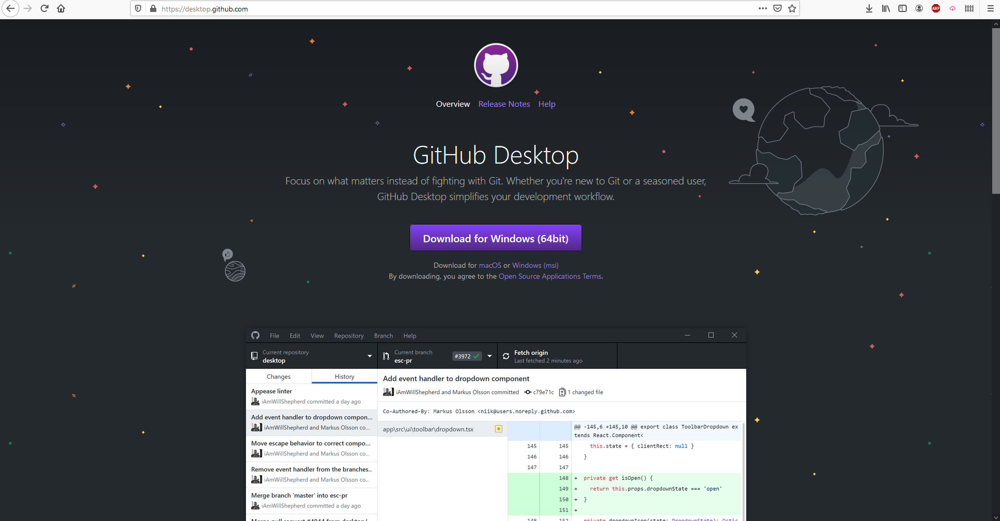
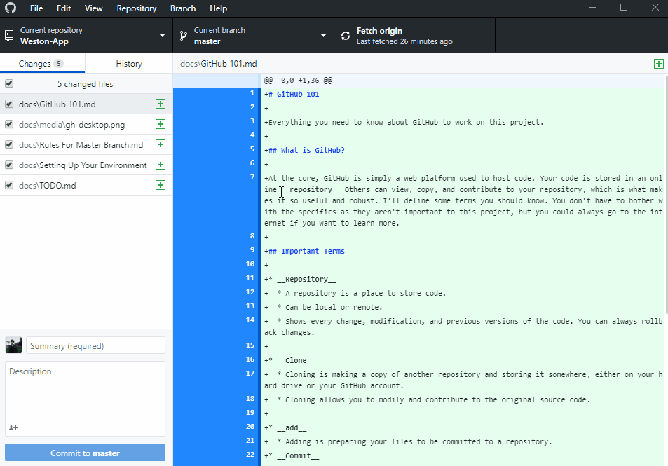
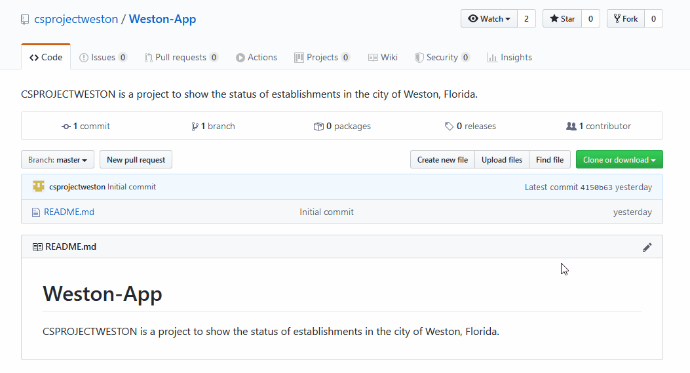
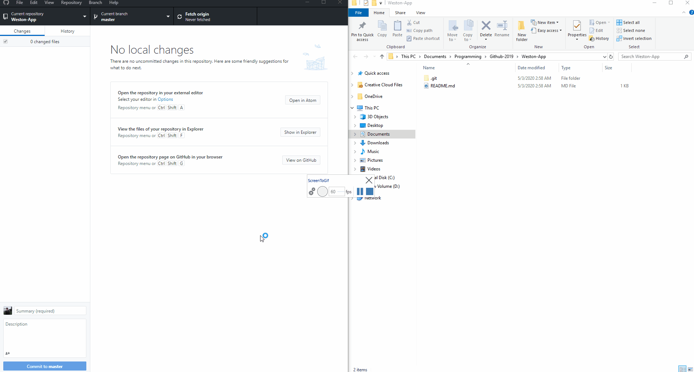

# Setting Up Your Environment

We will be using GitHub Desktop, as it is easier to use and comes with a GUI. Head over to the [download page](https://desktop.github.com/):

Download for your platform, for me it would be Windows. Run the executable after the download finishes. Let the program install, and it should open automatically completed.

The first thing you should do is log into your account. You can do this by going to File > Options > Sign In

After this step is completed, head to the repository you will be working on. In this case, we will use [our repository](https://github.com/csprojectweston/Weston-App). Click the green dropdown and click "Open in Desktop".

GitHub desktop is pretty easy to figure out so I won't cover it in depth; however, I'll show an example of creating, committing, and pushing a file to the repository.

